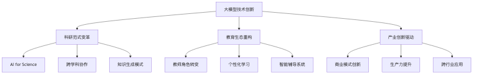
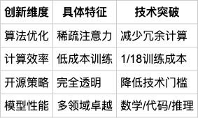
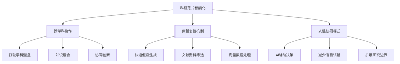
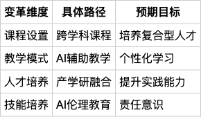
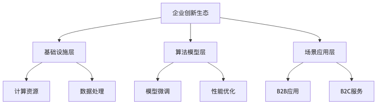
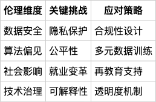

#  DeepSeek冲击下的科学研究范式重塑、高校人才培养变革与企业创新竞争力的挑战

## 1. 引言：大模型技术的创新生态与范式转型


大模型技术正在以前所未有的深度和广度重塑科技创新生态系统，展现出跨领域、系统性的革命性变革。这场技术创新不仅仅是单一技术维度的突破，更是对传统科研、教育和产业范式的根本性重构[20]。

以DeepSeek为代表的大模型技术正在多个维度深刻影响创新生态。在技术创新层面，通过混合专家模型、多头潜在注意力等创新技术，DeepSeek实现了低成本、高效率的技术突破 [58]。公司通过完全开源、算法优化和降低算力需求，颠覆了传统大模型依赖大量算力和数据的局限，仅以极低的成本就在多个领域取得卓越性能 [78]。

技术创新正推动科学研究迈向第五范式——AI for Science（AI4S）。传统的科研范式正被AI技术深度重塑，科研的思维方式、组织模式和决策模式发生革命性变化 [20]。这种创新不仅限于技术本身，更体现为发展理念、模式和路径的全面转型 [25]。

在教育领域，大模型技术正重构传统的教育生态，形成教师、学生、AI三维协同的新型系统 [61]。在产业创新维度，生成式人工智能已成为商业模式创新的关键驱动力，全球70%的组织已开始投资或测试相关技术 [47]。

然而，尽管展现出巨大潜力，大模型技术发展仍处于初级阶段。目前的知识生成主要停留在显性知识复述和跨领域知识组合，尚未实现根本性理论创新 [2]。这意味着技术创新仍有广阔的发展空间。

正如中国工程院院士王坚所指出，人工智能已经超越工具层面，正在掀起科学革命 [53]。以DeepSeek为代表的大模型技术，不仅改变了技术创新方式，更重要的是重塑了创新的生态系统和社会协作模式，标志着人类进入一个全新的技术创新时代。
### 1.1 DeepSeek技术创新的生态意义

```table
| 表头1 | 表头2 | 表头3 |
| ------ | ------ | ------ |
| 数据1 | 数据2 | 数据3 |
| 数据4 | 数据5 | 数据6 |
```
DeepSeek的技术创新正在深刻重塑科技创新生态系统，展现出颠覆性的研究范式变革。作为一家专注于通用人工智能(AGI)的中国科技公司，DeepSeek不仅仅是一个技术平台，更是一个推动科技创新生态系统变革的关键力量 [21]。

在技术创新层面，DeepSeek通过多项关键技术突破重塑了人工智能发展范式。其R1和V3模型体现了混合专家(MoE)模型和多头潜在注意力(MLA)等创新技术，以低成本、高效率的训练方式取得了显著突破 [58]。特别是DeepSeek-R1模型，能够对复杂问题进行逻辑拆解与规划，具备归纳总结和反思改进的能力，为通用人工智能(AGI)的发展提供了新的可能性 [18]。

DeepSeek的创新还体现在其独特的技术路径和生态构建策略。通过完全开源、算法优化和降低算力需求，公司打破了传统大模型依赖大量算力和数据的局限 [33]。以惊人的成本效益著称，DeepSeek仅以1/18的训练成本和1/10的团队规模，就在数学、代码和自然语言推理等任务上取得了卓越性能，颠覆了国际社会对AI研发的传统认知 [78]。

在算法优化方面，DeepSeek采用了多项创新技术，包括稀疏注意力减少冗余计算、动态模型压缩（如权重剪枝、知识蒸馏），以及课程学习和渐进式训练，追求"单位算力下的性能最大化" [41]。这种技术路径不仅显著降低了推理成本，还在更低的算力需求下实现了更高质量的生成效果。

值得注意的是，DeepSeek的技术创新已经开始深入影响多个领域的创新生态。在科研领域，其AI助手实现了大语言模型与科研全流程的深度融合，构建了"科研对话式协作"的创新生态 [57]。在职业教育领域，DeepSeek正引发前所未有的变革，不仅是技术创新，更是推动教育生态系统变革的关键力量 [76]。

正如中国工程院院士王坚所指出的，人工智能已经超越工具层面，正在掀起科学革命，DeepSeek代表了AI技术对科学研究范式的颠覆性影响 [53]。通过降低技术门槛、推动开放创新，DeepSeek不仅改变了技术创新的方式，更重要的是重塑了创新的生态系统和社会协作模式。
### 1.2 技术创新的多维度影响
大模型技术正在以系统性、多维度的方式深刻重塑科研、教育和产业格局，呈现出跨领域、颠覆性的创新特征。从技术创新的宏观视角来看，这一革命性变革不仅仅是单一领域的技术突破，更是对传统生产方式、知识生成和创新范式的根本性重构[20]。

技术创新的第一个维度体现在科研范式的变革。人工智能，特别是以大模型技术为代表的创新，正在推动科学研究迈向第五范式——AI for Science（AI4S）。传统的实验、理论、计算和数据驱动四大范式正被AI技术深度重塑，科研的思维方式、组织模式和决策模式都发生了革命性变化[20]。例如，在生命科学领域，研究者通过将基因表达数据类比为语言模型中的"语料"，构建跨物种的生命基础大模型，探索生命的底层共性规律[14]。

在教育领域，技术创新正在重构传统的教育生态。大模型技术正在打破传统的师生二维关系，形成教师、学生、AI三维协同的新型教育生态系统[61]。生成式人工智能催生了"人机共育"的教育新形态，人机协同将成为未来工作的新常态，传统的知识生成和传授模式难以满足未来社会对高阶思维、创新能力和智能素养的需求[43]。

在产业创新维度，大模型技术正在重塑企业的竞争logic。技术创新已从单纯的效率提升工具转变为商业模式创新的关键驱动力[42]。目前，全球已有超过70%的组织开始投资或测试生成式人工智能技术，17%的组织已将AI应用引入生产环节[47]。

更为深远的是，这种技术创新正在推动"新质生产力"的形成。它不仅仅是技术层面的革新，更体现为发展理念、模式和路径的全面转型[25]。技术创新的生态属性日益凸显，跨领域、跨学科的协同创新模式正逐步取代传统的单一领域创新模式[63]。

值得注意的是，尽管大模型技术展现出巨大潜力，但其发展仍处于初级阶段。目前，大模型的知识生成主要停留在显性知识复述、隐性知识显性化和跨领域知识组合的阶段，尚未实现根本性理论创新[2]。这意味着技术创新仍有广阔的发展空间。

总的来说，以DeepSeek为代表的大模型技术正在多维度、系统性地重塑科技创新生态。它不仅是技术的迭代，更是一场涵盖科研、教育、产业的深刻变革，正在重构我们认知世界、创造价值的方式[70]。
## 2. 科学研究范式的智能化重构


人工智能技术正在深刻重塑科学研究的传统范式，DeepSeek等大模型成为推动这一变革的关键力量。这一重构不仅体现在技术层面的创新，更展现出科研组织形式、知识生产模式和跨学科协作的根本性转变。

科研范式的智能化重构呈现出多维度特征。首先，AI正在打破学科壁垒，推动跨学科协作成为科技创新的重要组织方式。传统单一、封闭的研究模式正被开放、智能、协同的新模式取代，研究者可以借助AI技术突破认知局限，构建科学探索的平行空间 [2,29]。

其次，AI为科研提供了多维度创新支持。大模型作为科学发现的"加速器"和"连接器"，能够快速生成假设、筛选文献资料、处理海量数据，显著提升科研效率。例如，在生命科学领域，通过处理海量单细胞数据，AI模型实现了对基因表达调控规律的全景式学习 [14]。

更为重要的是，这一范式转型体现了人机协同的新模式。AI并非简单地替代人类科研工作，而是提供解决长期科研痛点的有效手段，如提高数据处理效率、减少盲目试错、突破传统研究局限 [18,20]。

计算范式的革命性转变尤其显著。传统的封闭研究循环正向开放、跨学科、智能交互的模式演进。DeepSeek等技术通过底层计算优化和异构计算单元，实现了计算效率和交互模式的创新。研究者可以通过自然语言直接与AI系统进行复杂的数据查询和协作 [40]。

展望未来，科研范式可能进入"第五范式"——更加强调人、机器和数据之间的动态交互。这一新范式将突破现有计算智能的能力边界，推动科学研究进入一个更加智能、高效、跨学科的新纪元 [15]。研究型大学和科研机构需要从传统的科层组织转向以科研目标和项目为驱动的矩阵式组织结构，促进学科交叉融合和资源集群化发展 [44]。
### 2.1 AI驱动的科研创新模式
随着人工智能技术的快速发展，科学研究正在经历前所未有的范式转型。DeepSeek等大模型为科研创新提供了革命性的技术支持，重塑了传统的科研方法论，特别是在跨学科协同和知识创新方面 [18,70]。

首先，AI技术正在突破传统科研的学科壁垒，推动跨学科协作。学科交叉已成为科技创新的重要组织方式，有41%的诺贝尔奖获得者正是通过跨学科研究取得的重大突破。DeepSeek等大模型作为跨学科研究的"连接器"，能够突破人类专家的认知局限，构建科学探索的平行空间，模拟不同理论框架下的可能性 [2,29]。

其次，AI为科研提供了多维度的创新支持。大模型可以作为科学发现的"加速器"，快速生成待验证假设；在研发领域，可以帮助科学家快速筛选学术论文、数据集和实验结果，简化信息检索和分析过程。例如，在生命科学领域，GeneCompass模型通过处理1.26亿个单细胞数据，实现了对基因表达调控规律的全景式学习和理解 [14,40]。

更为重要的是，AI正在重塑科研的组织方式。传统的单一主体、"作坊式"科研模式正在被AI驱动的协同创新模式取代。DeepSeek推动了小型化、高密度的科研团队形成，强调成员背景的多元化，形成跨学科、跨领域的创新生态。在某些领域，如新药研发、材料科学和疾病诊断，AI可以将传统研究所需的数百年工作压缩至几个月甚至几天 [5]。

值得注意的是，这种AI驱动的科研创新并非简单的技术替代，而是人机协同的新范式。AI为科研人员提供了解决长期痛点的有效手段：更有效地应用基本原理、提高数据处理效率、突破传统科研局限、减少盲目试错。《Nature》的研究表明，DeepSeek在数学和科学问题解决能力上已可与OpenAI的模型相媲美，为科学家提供了定制和训练专门推理模型的新工具 [18,20]。

展望未来，科研范式可能正在向更加开放、协同、智能的方向发展。第四范式（数据驱动的科学研究）的局限性促使我们探索"第五范式"——更强调人、机器及数据之间的交互，突破现有计算智能的能力边界 [15]。DeepSeek等技术的出现，标志着科学研究正进入一个更加智能、高效、跨学科的新纪元。
### 2.2 计算与交互范式的革命性转变
大模型驱动的计算范式正在彻底重塑科学研究的传统模式，呈现出多维度、革命性的转变趋势。传统科研模式以"专家出题、专家评审、专家解题、专家验收"的封闭循环为特征，而生成式AI正在推动这一范式向开放、跨学科、智能交互的新模式演进 [63]。

在计算范式方面，DeepSeek通过底层GPU优化和混合专家模型，实现了计算效率和交互模式的创新。其在CUDA层面的优化和独特的GPU通信调度策略展示了计算的新可能性，并通过透明的推理过程使AI更具可解释性 [58]。具体而言，模型采用异构计算单元，支持动态硬件级精度切换，在目标检测任务中实现了Backbone层自动启用FP4模式，同时保持检测头的FP8计算，使精度损失控制在0.5%以下，显存占用降低62% [65]。

交互范式的革命性转变尤其显著。传统科研交互模式被自然语言界面彻底颠覆，研究者现在可以通过日常语言直接与AI系统进行复杂的数据查询和协作。例如，DeepSeek AI改变了传统的数据交互方式，使用户能够使用日常语言直接查询复杂的数据集 [40]。研究者可以通过结构化的提示词，精确地表达需求，实现从"编写提示"到"需求表达"的转变 [28]。

学科交叉是这一计算范式转变的重要特征。AI正在促进不同学科之间的知识融合，帮助学者突破学科边界。"AI for Science"的核心特征是跨学科融合，将计算机、数据科学、材料、化学、生物等多学科研究者连接在一起，推动知识生产模式从高度细分向交叉综合转型 [16,20]。

未来的计算范式可能进一步发展为神经-符号混合系统，整合大模型的数据学习能力和符号AI的逻辑推理能力。关键技术路径包括：结合大语言模型生成能力与符号AI的逻辑验证，将大模型与物理引擎对接实现假设检验，并开发持续学习机制 [2,4]。

这一计算范式的革命不仅是技术创新，更代表了科研组织形式和知识生产模式的根本性变革。研究型大学和科研机构需要从传统的科层组织转向以科研目标和项目为驱动的矩阵式组织结构，促进学科交叉融合和资源集群化发展 [44]。
## 3. 高校人才培养的智能化变革


在DeepSeek等新兴人工智能技术的推动下，高等教育正面临深刻的人才培养范式变革。这一变革主要体现在两个核心维度：跨学科创新人才培养和AI赋能教育实践路径，共同构建了面向未来产业的教育生态系统。

跨学科创新人才培养是当前高等教育转型的关键路径。面对未来产业的复杂性和多元化特征，高校需要突破传统学科壁垒，构建面向前沿领域的创新人才培养模式 [30]。这一转型要求高校在多个维度进行深层次变革：

1. 建立多元化的人才培养模式，如专职聘任、联合聘任和集群聘任等 [16]。
2. 深化产学研融合，通过政策支持和长期合作机制，促进教育与产业的紧密结合 [37]。
3. 培养学生的AI素养和伦理意识，关注AI知识理解、实践能力和跨学科思维 [20]。

同时，AI技术为教育变革提供了强大的技术支撑。DeepSeek等大模型正在重塑教学模式，将教师角色从单一知识传授者转变为学习引导者和智能助手 [67]。通过智能体技术，教育系统可以实现更精准的个性化学习支持，为每个学生提供动态、精准的学习体验 [43]。

教育部也在积极推动这一进程，支持高校面向集成电路、人工智能、量子科技等关键领域布局专业，深化新工科、新医科等建设 [79]。这种系统性变革不仅是技术应用，更是教育理念的根本性革新。

未来，高校需要继续探索：
- 构建开放、灵活的跨学科人才培养生态系统
- 深化AI技术在教育中的创新应用
- 培养具备数字能力和系统思维的创新型人才

总之，在DeepSeek等技术的推动下，高校正在经历一场深刻的教育变革，旨在培养能够应对未来复杂挑战的创新型人才。
### 3.1 跨学科创新人才培养
在DeepSeek等新兴技术推动下，高等教育正面临深刻的人才培养范式变革。未来产业的复杂性和跨学科特征，要求高校构建面向前沿领域的创新人才培养生态系统，实现教育与产业的深度融合。

首先，高校需要突破传统学科壁垒，推动跨学科、复合型人才培养模式的创新。研究表明，未来产业具有多领域、多主体协同的特点，迫切需要培养具备跨学科创新能力的复合型人才 [30]。清华大学等高校已开始探索创新路径，如2009年启动的"信息艺术设计"交叉学科研究生培养项目，通过"多入口、一个平台、多出口"的模式，培养学生的知识迁移和跨学科问题解决能力 [3]。

其次，产学研深度融合成为培养高素质创新人才的关键机制。西方发达国家的经验表明，通过法律法规和政策支持，可以有效促进高校、科研机构与企业之间的协同育人 [37]。浙江省的实践进一步证明，通过完善政策体系和建立长期合作关系，可以支持科研人员深化产学研合作，并明确科技成果转化的收益分配机制 [75]。

再者，人工智能和大模型技术为跨学科人才培养提供了全新的工具和平台。DeepSeek等推理模型展示了复杂问题的思考过程，可以成为教育中的创新工具，帮助学生理解跨学科问题解决策略 [58]。教育智能体作为连接大模型与多元化教育场景的关键桥梁，将助力构建人机间的"协同教学"、"协同学习"和"协同决策"应用场景 [43]。

值得关注的是，高校在培养跨学科创新人才时，应当注重以下几个方面：
1. 建立多元化的人才培养模式，如专职聘任、联合聘任和集群聘任等 [16]。
2. 培养学生的AI素养和伦理意识，关注AI知识理解、实践能力、社会责任和跨学科思维 [20]。
3. 鼓励学生参与创新竞赛和创业项目，打破学科界限 [5]。

教育部也在积极推动这一进程，支持高校面向集成电路、人工智能、量子科技等关键领域布局专业，深化新工科、新医科等建设，培育交叉融合的新兴专业 [79]。

总之，跨学科创新人才培养是高等教育适应未来产业发展的必然选择。通过打破学科壁垒、深化产学研合作、利用人工智能技术，高校可以构建更加开放、灵活、创新的人才培养生态系统。
### 3.2 AI赋能教育的实践路径
在AI技术的推动下，高等教育正经历profound transformation，呈现出多维度、跨学科的创新发展态势。DeepSeek等大模型为教育生态系统重构提供了关键技术支撑，显著改变了传统教学方法和人才培养范式[8,67]。

首先，AI赋能教育的核心是重塑教学模式。教师角色从单一知识传授者转变为学习引导者和智能助手。例如，北京师范大学在近万门课程中本地化部署DeepSeek-R1大模型，提供包括学业规划、知识问答、概念讲解、资源推荐、解题启发、论文润色、写作指导等多元化教学辅助功能[67]。这种模式不仅减轻了教师负担，还显著提升了教学的个性化和智能化水平。

其次，AI技术正在推动跨学科、实践导向的人才培养模式。高校正积极调整学科专业布局，到2025年计划优化20%的专业设置，重点支持人工智能、集成电路等关键领域[61]。例如，清华大学实施大类招生，将专业合并为16个大类，并成立全球创新学院，打破传统专业边界，鼓励学生跨专业、跨学科协作[3]。

在实践路径上，高校正探索多元化的AI赋能模式。职业教育领域尤其突出，如河南工业职业技术学院将AI技术融入数控机床优化和自动化控制等实际场景，通过项目式学习强化学生解决复杂问题的能力[76]。大模型不仅提供智能辅导，还能帮助学生进行实验设计、推荐代码模板，为教育实践提供全方位智能支持[57]。

同时，跨主体协同成为AI赋能教育的重要特征。通过政府、教育机构、企业多方合作，构建多层次、互补的教育培养策略，培养能利用AI技术进行跨学科研究的新一代科研人才[20]。一些高校已开始探索"学术与实践双导师"制，建立企业实践基地，推进AI在教育管理和决策中的深度应用[12]。

值得注意的是，AI赋能教育不仅是技术应用，更是教育理念的革新。这要求培养学生的AI思维，理解AI的能力边界和最佳应用场景，引导学生成为具备数字能力和系统思维的创新型人才[66]。

展望未来，AI将持续重塑教育生态。通过智能体技术，可以实现更精准的个性化学习支持，动态调整教学策略，为每个学生提供精准、高效的学习体验[43]。这一变革不仅改变了教与学的方式，更将培育适应未来复杂挑战的创新型人才。
## 4. 企业创新竞争力的智能化重构


在人工智能技术快速发展的背景下，大模型正在重塑企业创新生态系统和竞争格局。以DeepSeek为代表的开源模型正在推动技术创新与产业发展的深度融合，形成多主体参与的创新协同机制 [18,55]。

企业创新生态的构建呈现出多层次、系统性的特征，主要包括基础设施、算法模型和场景应用三个关键层次。开源模型正在催生更为开放和协作的创新模式，通过降低技术门槛和加速创新扩散，推动企业在医疗、金融等行业的技术突破 [47]。

创新生态的构建需要政府、企业、高校和科研院所的多元主体协同。未来产业发展要求各方根据功能定位协同发力，形成既有分工又有配合的创新整体 [32]。生成式AI正成为企业竞争优势的关键，75%的企业领导者认为未来竞争将取决于谁拥有最先进的生成式AI [52]。

然而，企业创新生态的构建仍面临诸多挑战。数据治理、技术适配和模型可解释性等问题需要持续攻关。企业需要建立统一的数据流程，构建"人机环境系统"，确保模型训练的效率和效果 [59]。

算力已成为企业技术创新的关键支撑。国家超算平台为企业提供共享算力资源，通过多维度的协同机制推动技术突破。企业正通过创新技术如混合专家模型、边缘计算等，优化算力使用，降低计算资源需求 [55,58]。

总的来说，以DeepSeek为代表的开源大模型正在重塑企业创新生态，推动技术创新与产业发展的深度融合。未来，构建开放、协作、多元的创新生态将成为企业保持竞争力的关键战略。
### 4.1 大模型驱动的企业创新生态
在AI技术快速发展的背景下，大模型正在重塑企业创新生态系统，为产业发展带来前所未有的机遇与挑战。以DeepSeek为代表的开源模型正在推动技术创新与产业发展的深度融合，形成多主体参与的创新协同机制 [18,55]。

企业创新生态的构建呈现出多层次、系统性的特征。从基础架构层面看，企业创新机制可以划分为三个关键层次：基础设施层、算法模型层和场景应用层。基础设施层提供高效的计算资源和数据处理能力，包括超大规模计算、网络、存储和中间件；算法模型层通过模型微调实现针对特定用例的优化；场景应用层则重点开发B2B和B2C应用程序，将大模型能力与实际应用深度融合 [36]。

在技术创新路径上，开源模型正在催生更为开放和协作的创新生态。DeepSeek通过全栈开放，引发了开源社区、云平台、芯片企业和AI应用开发者的广泛参与，形成技术扩散的"蒲公英效应" [18]。这种开放模式不仅降低了技术门槛，还显著加速了创新扩散。例如，多家企业如中兴通讯已实现DeepSeek模型内嵌，创建类似多专家系统，在医疗、金融等行业加速创新，如在0.8秒内生成百种疾病诊断意见 [47]。

创新生态的构建需要多元主体的协同。未来产业发展要求政府、企业、高校与科研院所根据各自功能定位同向发力，形成既有分工又有协同配合的创新整体 [32]。具体而言，企业在产学研深度融合中应发挥"决策者、出题者、引领者、出资者"的多重角色，主动融入全球科技创新网络。高校和科研院所则可以通过共建研发机构、开展科技成果转化等方式，加速创新成果的产业化 [63]。

在AI赋能企业创新方面，生成式AI正在重塑传统创新模式。75%的企业领导者认为未来的竞争优势将取决于谁拥有最先进的生成式AI，65%的领导者相信生成式AI将在未来三到五年内对组织产生巨大影响 [52]。DeepSeek等大模型不仅为企业提供商业智能解决方案，还能帮助企业分析客户和市场数据，识别趋势，预测市场状况 [40]。

值得注意的是，企业创新生态的构建仍面临诸多挑战。数据治理、技术适配、模型可解释性等问题需要持续攻关。企业需要建立统一的数据采集、清洗和标注流程，构建"人机环境系统"，确保模型训练的效率和效果 [59]。

总的来说，以DeepSeek为代表的开源大模型正在重塑企业创新生态，推动技术创新与产业发展的深度融合。未来，构建开放、协作、多元的创新生态将成为企业保持竞争力的关键战略。
### 4.2 算力与创新能力的协同
在人工智能和大模型快速发展的背景下，算力已成为企业技术创新的关键支撑力量。国家超算平台和企业算力优化正在重塑创新生态系统，通过多维度的协同机制推动技术突破。

首先，国家超算平台为企业和研究机构提供了共享算力资源的重要基础 [55]。这一平台使得更多企业能够获得高性能计算资源，促进AI模型的训练与应用。例如，通过国家超算互联网平台，企业可以显著降低计算成本，实现算力与创新能力的深度协同。

在算力优化方面，企业正通过多种创新技术降低计算资源需求。DeepSeek在这一领域取得了显著突破，通过创新的融合架构和算法，显著提升了计算效率。例如，在长文本处理任务中，其处理速度提升了一倍，为企业提供了更高效的AI技术解决方案 [33]。中国联通通过难度自适应微调和二次蒸馏等技术，实现了模型推理计算量平均节省30% [60]。

值得注意的是，算力优化已成为企业创新的重要战略。一些企业通过创新的技术路径，如混合专家模型和底层GPU调度，不仅提高了计算效率，还为企业提供了技术突破的可能性 [58]。FlashMLA技术专门针对Hopper架构设计，仅使用单卡GPU就可以显著提升模型推理性能，体现了算力优化对企业创新的重要性 [73]。

此外，边缘计算和端侧智能的发展为企业创新提供了新的可能性。大模型向边缘和端侧的小模型输出模型能力，小模型负责实际推理与执行，并向大模型反馈算法与执行成效，形成一种协同进化的计算模式 [34]。这种模式不仅优化了算力使用，还为企业创新提供了更灵活的技术路径。

从更宏观的角度看，算力与创新能力的协同已成为推动产业升级的关键驱动力。中国制造业的成本优势正从"劳动力价差"转向"智能化协同降本"。AI技术的边际成本趋近于零，使中小企业集群成为AI红利的最大受益者。以佛山陶瓷产业带为例，一个AI窑炉控温模型的初期研发投入为200万元，但在100家企业铺开后，单家企业分摊成本仅2万元，却能降低15%-20%的能耗 [17]。

总的来说，算力与创新能力的协同已成为推动企业技术进步的重要机制。通过国家超算平台、算力优化技术、边缘计算等多元路径，企业正在构建更加高效、灵活的创新生态系统，为技术突破和产业升级创造了新的可能性。
## 5. 技术伦理与可持续发展


在人工智能快速发展的背景下，技术伦理与可持续发展已成为学界和产业界共同关注的重大议题。本节从两个核心维度深入探讨：智能技术应用的伦理边界和开放协同的创新生态系统，旨在揭示AI技术发展中的伦理挑战与创新路径。

首先，在智能技术应用的伦理边界方面，核心问题聚焦于如何在技术进步与人文价值之间实现平衡。大模型的黑盒性、数据安全、隐私保护以及社会影响构成了技术伦理治理的主要维度。专家们强调，尽管AI工具日益强大，但仍需坚持"科技向善"的根本原则，将人类的创造力、判断力和价值观置于首位 [66]。企业在引入AI技术时需要审慎考虑伦理问题，制定系统性的管控方案。

其次，开放协同的创新生态系统正在重塑科技创新范式。不同于传统的封闭模式，新兴的创新生态强调多主体协同、跨学科融合和开放共享。企业、高校、科研机构和政府正构建一个互联互通的创新网络，打破传统科研组织边界。DeepSeek等开源AI技术的出现进一步加速了这一进程，使AI技术从少数科技巨头的专属工具转变为开放的基础设施 [18,47]。

关键挑战在于如何在技术创新与伦理约束之间找到平衡点。这需要技术创新者、政策制定者、学术界和产业界的共同参与。未来的区域竞争将越来越依赖于"AI技术深度×生态协同密度"的复合效应，技术创新不仅关注单点突破，更要注重创新生态系统的整体性和包容性 [32]。

总的来说，技术伦理与可持续发展已经成为人工智能发展的关键命题。我们需要在开放、包容、负责任的原则下推动AI技术创新，确保技术发展始终服务于人类社会的根本利益，在科技进步与人文价值之间找到微妙而动态的平衡。
### 5.1 智能技术应用的伦理边界
在人工智能快速发展的背景下，构建"以人为本"的智能技术应用伦理框架成为当前学术界和产业界共同面临的重大挑战。人工智能技术的伦理边界不仅涉及技术本身，更关乎社会价值和人文关怀。

首先，大模型的黑盒特性为伦理治理带来了多重挑战。在金融、医疗和司法等高风险领域，如何确保模型的公平性、可解释性和透明性成为亟待解决的问题 [28]。专家们强调，尽管AI工具变得愈发强大，仍然要将人类的创造力、判断力和价值观放在首位，坚持"科技向善"的根本原则 [66]。

其次，数据安全和隐私保护是智能技术伦理治理的关键。DeepSeek等AI平台已经开始通过内置数据安全和合规性功能，确保数据处理符合国际法规如GDPR和CCPA，同时保护用户隐私 [40]。企业在引入AI技术时需要审慎考虑伦理问题，仅5%的企业目前制定了完善的AI管控计划，这凸显了伦理治理的紧迫性 [52]。

再者，AI技术的广泛应用可能引发深刻的社会结构变革。技术普及是否会导致大规模失业，或催生新的人工智能中产阶层，这些都对社会治理提出了新的挑战 [24]。因此，需要通过有效政策确保社会公平和稳定。

值得注意的是，在教育领域，专家们认为AI虽然能高效传递知识，但无法替代教师的情感支持和个性化指导。这突显了在AI应用中维护人性温度和价值观教育的重要性 [76]。同时，高校应积极参与人工智能监管相关法律、法规及标准的研究，推动科技伦理规范体系建设，确保AI技术可用、可靠、可控 [12]。

最后，中国在AI治理上已经采取积极态度。《全球人工智能治理倡议》强调创造开放、包容、无障碍的发展环境，体现了对负责任AI发展的commitment [78]。通过开源模型和技术透明度，如DeepSeek这样的平台为智能技术的伦理讨论提供了新的视角，强调技术的可获得性和开放性 [58]。

总之，构建智能技术应用的伦理边界是一个系统性工程，需要技术创新者、政策制定者、学术界和产业界共同参与，在技术进步与人文价值之间找到微妙的平衡点。
### 5.2 开放协同的创新生态系统
AI技术正在从根本上推动科研范式从封闭走向开放，重构科技创新的协作生态。在这一过程中，开放协同成为推动创新的核心驱动力，不仅改变了传统的科研组织形态，还为跨学科、跨领域的创新提供了全新可能 [16,63]。

创新生态系统的构建呈现出多元化和开放性特征。企业、高校、科研机构和政府正在形成一个多主体协同的创新网络。通过建立"龙头企业牵头、高校院所支撑、各创新主体相互协同"的创新联合体，组建"科学家+企业家+金融家"的跨界团队，打破了传统科研的组织边界 [32,63]。

DeepSeek等开源AI技术的出现，进一步加速了这一创新生态的构建。其开源策略不仅降低了AI技术的使用门槛，还促进了开发者社区的协作，推动了AI技术的快速迭代与发展。通过公开模型权重和技术报告，DeepSeek实现了技术的开放共享，使AI从少数科技巨头的专属工具转变为类似"水电煤"的基础设施 [33,47]。

学科交叉和跨界协同成为创新生态的关键特征。研究型大学正在构建开放、开源的创新生态系统，推动学科交叉的自由流动，给予科研人员充分的研究自主权，开辟数据开放、信息联通、成果共享的新渠道。例如，清华大学通过开放交流时间、交叉专题论坛等方式，调动全校师生参与跨学科合作 [3,16]。

未来的区域竞争将成为"AI技术深度×生态协同密度"的复合函数。技术深度决定单点创新高度，生态密度决定应用广度。不同产业集群，如长三角和珠三角，正通过AI技术形成差异化的生态竞争优势。这种生态系统不仅关注技术创新，还注重人才、资本等创新要素的集约化整合 [17,32]。

总的来说，开放协同的创新生态正在重塑科技创新范式，推动科研从封闭走向开放，为未来产业发展注入新的活力和创新动能。这一生态系统强调跨界融合、开放共享和多主体协作，将成为驱动科技创新的关键机制 [18,30]。
## 6. 结论：DeepSeek引领的技术范式变革
DeepSeek代表了一种深刻的技术范式变革，正在全面重构科研、教育和产业的创新生态系统。这一变革不仅仅是技术本身的突破，更是对传统创新模式的系统性重塑。通过降低技术门槛、促进跨学科协作和推动开放式创新，DeepSeek正在重新定义技术创新的边界和可能性。

在创新生态系统中，技术正在呈现出开放、协同和跨界融合的新特征。中小企业通过AI技术优化产业生态，高校正推动学科间的"裂变"与"聚变"，而科技部门则积极构建公共算力平台，鼓励更广泛的用户参与模型研究。这种多元主体的协同创新模式，正在重构传统的技术创新路径。

教育和科研领域正经历深刻变革。AI技术正降低科研门槛，通过智能文献引擎和对话式协作工具，让科研变得更加高效和accessible。在教育领域，DeepSeek正推动教学模式、专业建设和人才培养方式的系统性重构，为未来人才培养提供全新的技术支持。

企业和高校在这一生态重构中扮演关键角色。高校需要发挥教育、科技、人才"三位一体"的优势，建立更开放的产学研协同机制。企业则需要全方位支持AI转型，包括预算投入、组织架构调整和人才储备。

更为重要的是，DeepSeek不仅仅是一项技术创新，更象征着一种新的创新范式。通过技术平权和降低创新门槛，它有潜力重塑全球人工智能应用格局，推动生产力和生产关系的革命性变革。这种范式转变将为科技、教育和产业带来前所未有的发展机遇，标志着人工智能时代创新生态的全新可能。
### 6.1 创新生态系统的系统性重塑
DeepSeek作为人工智能技术的重要里程碑，正在全面重塑科研、教育和产业的创新生态系统。在这一系统性变革中，大模型技术展现出深远的创新潜力和变革能力 [78]。

技术创新正在推动创新生态的多维度重构。中小企业正通过AI布局实现产业生态优化，构建开放的数据共享与技术协同平台，这是中国制造业保持全球竞争力的关键策略 [17]。同时，产业跨界融合正加速发展，在超大规模市场、完整产业链的支持下，高端产业正打破传统边界，加快创新融合，有望加速颠覆性技术的产生和产业化 [26]。

创新生态的重塑体现在多个层面。在科研领域，DeepSeek正通过智能文献引擎和对话式科研协作，降低科研门槛，提升创新效率 [21]。教育领域也正经历深刻变革，AI技术推动教学模式、专业建设和培训方式的系统性重构 [76]。

高校和企业在这一生态重构中扮演着关键角色。通过深度产学研融合，高校应发挥教育、科技、人才"三位一体"的优势，推进"企业出题、共同答题、企业阅卷"的创新机制 [6]。同时，企业需要全方位支持AI转型，包括预算投入、组织架构调整、人才储备和内部协同机制 [42]。

技术创新的生态系统正呈现出开放、协同和跨学科的特征。学科交叉被视为关键核心技术突破的主要着力点，研究型大学应推动学科生态体系内部的"裂变"与学科间的"聚变" [16]。科技部也在积极推动AI for Science发展，通过公共算力平台建设、鼓励用户参与模型研究和加强跨学科研究布局来推动创新 [20]。

展望未来，DeepSeek不仅代表了技术创新，更象征着一种新的创新范式。通过降低技术成本、实现技术平权，它有潜力重塑全球人工智能应用格局，推动生产力和生产关系的革命性变革 [24]。这一创新生态系统的重构，将为科技、教育和产业带来前所未有的发展机遇。